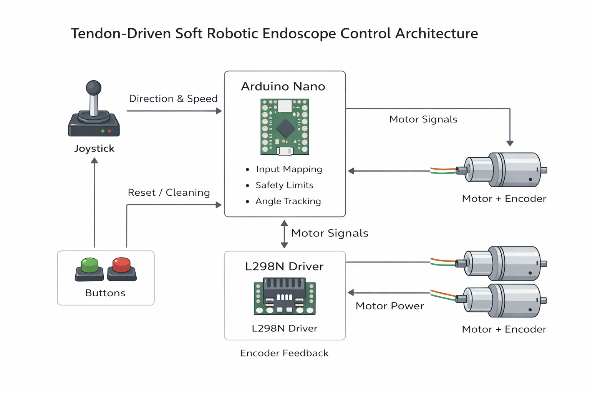

# Embedded Control System

## 1. Control Objectives

The objective of this project is to design and validate an embedded control system for a tendon-driven soft endoscopic robot with two degrees of freedom (2-DOF) bending. The control system is designed to:

- Enable intuitive human-in-the-loop control of soft bending motion
- Support independent bending in vertical (up/down) and horizontal (left/right) directions
- Enforce mechanical safety limits to prevent over-bending
- Provide reliable homing and reset functionality
- Validate control feasibility on a physical prototype

This project emphasizes **control robustness, safety, and experimental validation**, rather than high-precision model-based control.

---

## 2. Hardware Control Architecture

The embedded control system is built around an Arduino Nano microcontroller and consists of the following components:

- **Microcontroller:** Arduino Nano  
- **Actuators:** DC geared motors with incremental encoders  
- **Motor Driver:** L298N dual H-bridge driver  
- **User Interface:** Analog joystick and push buttons  
- **Power System:** External motor power supply  

Encoder feedback is used to estimate joint rotation angles corresponding to tendon actuation, enabling angle-based motion constraints.

---

## 3. Control Logic Overview

The control logic follows a human-in-the-loop open-loop structure with encoder-based feedback monitoring:

- Joystick inputs are mapped to motor direction and speed commands
- Each bending axis is controlled independently
- Encoder counts are converted to angular displacement
- Motion commands are limited by predefined angular safety thresholds
- Motors are stopped immediately when limits are reached

A manual reset button returns the system to a neutral (home) configuration.

This architecture prioritizes **simplicity, reliability, and transparency**, making it suitable for early-stage soft robotic prototyping.
### Reset and Homing Behavior

The system includes a dedicated reset mechanism triggered by a physical button.
When activated, both bending axes are commanded to return to their neutral (zero-angle)
configuration regardless of the current joystick input.

This behavior ensures:
- Safe recovery from arbitrary configurations
- Repeatable initialization before operation
- User confidence during manual control

**Demonstration Video:**
- `media/reset_demo.mp4`

---

## 4. Safety Constraints and Protection

To ensure safe operation, the following constraints are implemented:

- Maximum bending angle limited to ±90° for each axis
- Encoder-based angle tracking for real-time monitoring
- Immediate motor shutdown upon exceeding angle limits
- Manual homing button for emergency recovery
- Default stop behavior when no user input is detected

These safeguards are critical for tendon-driven soft robots, where excessive actuation may lead to mechanical failure.

---

## 5. Experimental Validation

A physical prototype was constructed using 3D-printed components. The embedded control system was successfully validated on the hardware platform, demonstrating:

- Stable joystick-based bending control
- Reliable enforcement of safety limits
- Robust response to manual reset commands

The full soft body and vision system were not integrated at this stage, as the focus of the project was control subsystem verification and feasibility assessment.

---

## 6. Future Improvements

Planned future extensions include:

- Closed-loop curvature control using PID or model-based methods
- Integration with CMOS camera feedback
- Full assembly with the complete soft robotic structure
- Migration to higher-level robotic frameworks (e.g., ROS)

---

# 嵌入式控制系统（Embedded Control System）

## 1. 控制目标

本项目旨在为一款**基于腱驱动的软体内窥镜机器人**设计并验证嵌入式控制系统。该机器人具备两个自由度（2-DOF）的弯曲能力，控制系统的主要目标包括：

- 实现直观的人机交互控制
- 支持上下与左右两个方向的独立弯曲
- 通过软件方式限制最大弯曲角度，确保系统安全
- 提供可靠的回位与复位功能
- 在实体原型上完成控制可行性验证

本项目的重点在于**控制系统的工程实现、安全性与实验验证**，而非高精度模型控制。

---

## 2. 控制硬件架构

嵌入式控制系统基于 Arduino Nano 构建，主要硬件组成如下：

- **主控单元：** Arduino Nano  
- **执行器：** 带编码器的减速直流电机  
- **电机驱动：** L298N 双 H 桥驱动模块  
- **人机接口：** 摇杆与按钮  
- **供电系统：** 外接电机电源  

编码器用于估算腱驱动对应的旋转角度，从而实现角度约束与安全控制。

---

## 3. 控制逻辑概述

控制系统采用人机在环（Human-in-the-loop）的开环控制架构，并结合编码器反馈进行状态监测：

- 摇杆输入映射为电机转向与转速
- 上下与左右两个方向分别独立控制
- 编码器计数用于计算电机转角
- 控制逻辑对弯曲角度进行实时限制
- 当超过安全阈值时立即停止电机

系统设置了回位按钮，用于将机构恢复至中性位置。

---

## 4. 安全约束设计

为确保系统运行安全，控制程序中实现了以下保护机制：

- 每个方向最大弯曲角度限制为 ±90°
- 基于编码器的实时角度监测
- 超出角度限制时立即停止电机
- 手动回位按钮用于紧急恢复
- 无输入时电机默认停止

这些安全约束对于腱驱动软体机器人尤为关键，可有效防止结构损坏。

---

## 5. 实验验证

本项目通过 3D 打印等方式搭建了实体原型，并在硬件平台上完成了控制系统验证，结果表明：

- 摇杆控制响应稳定
- 安全角度限制功能可靠
- 回位与复位功能正常

由于项目重点在于控制系统验证，完整的软体机器人本体与视觉系统尚未集成。

---

## 6. 后续改进方向

未来可扩展方向包括：

- 引入 PID 或模型控制实现闭环弯曲控制
- 集成 CMOS 相机反馈
- 完整系统装配与水下测试
- 接入 ROS 等高级机器人框架

