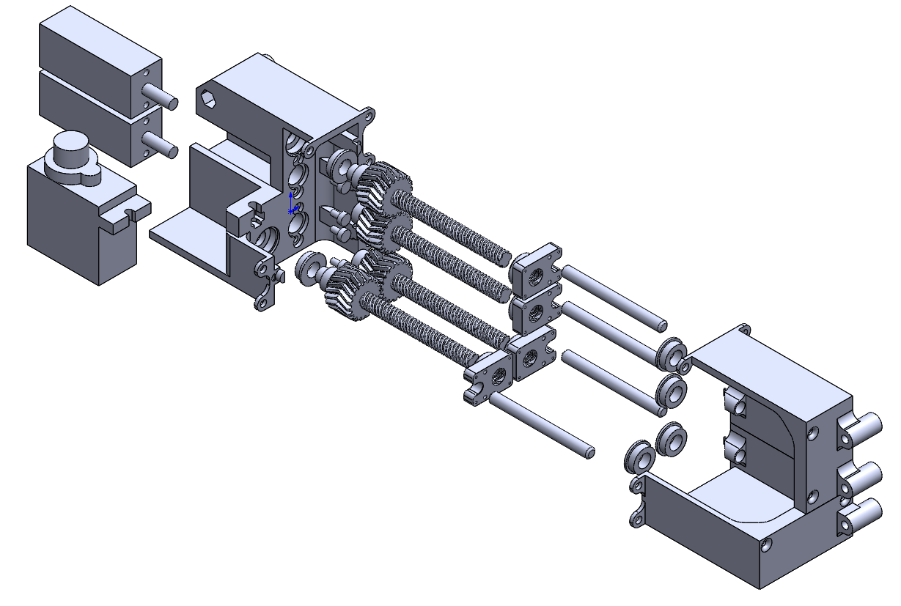

# Tendon-Driven Kinematics

This document describes the kinematic principles underlying the tendon-driven bending mechanism used in the soft endoscopic robot. The focus is on geometric relationships between tendon displacement and bending angle, which form the basis for motion estimation and safety constraint design.

---

## 1. Tendon-Driven Bending Concept

The soft robotic end-effector employs a tendon-driven actuation scheme commonly used in continuum and medical robots. Multiple tendons are routed along the length of the soft structure, and bending is produced by differential tendon displacement.

Key characteristics of this actuation method include:

- Remote actuation capability
- High structural compliance
- Smooth and continuous bending motion
- Mechanical simplicity at the distal end

In this design, tendons are arranged symmetrically to enable bidirectional bending.

---

## 2. Degrees of Freedom and Tendon Arrangement

The end-effector provides two independent bending degrees of freedom:

- Vertical bending (up / down)
- Horizontal bending (left / right)

Each bending direction is actuated by a pair of opposing tendons. For a given bending axis, bending is achieved by pulling one tendon while releasing the opposing tendon.

This antagonistic tendon arrangement allows controlled bending while maintaining passive structural stability.

---

## 3. Geometric Relationship Between Tendon Displacement and Bending Angle

Under the assumption of constant curvature, the relationship between tendon displacement and bending angle can be approximated geometrically.

Let:

- θ be the bending angle of the soft segment
- r be the radial distance between the tendon and the neutral bending axis
- ΔL be the change in tendon length

The tendon displacement can be approximated as:

ΔL = r · θ

This linear relationship provides a simple and effective mapping between motor actuation and bending angle for small to moderate deformations.

---

## 4. Actuation Transmission and Displacement Generation

Tendon displacement is generated through a motor-driven transmission system consisting of:

- A DC gear motor
- A lead screw mechanism
- A tendon attachment interface

Motor rotation is converted into linear tendon displacement through the lead screw, allowing precise control of tendon length change.

The total tendon displacement depends on:

- Motor rotation angle
- Gear reduction ratio
- Lead screw pitch

These parameters together define the conversion factor between encoder counts and tendon displacement.
## Tendon-Driven Actuation Mechanism

The actuation unit employs a tendon-driven mechanism based on lead screws and spur gears.
Two independent motor-gear assemblies are used to control bending in orthogonal planes
(up/down and left/right).

Rotational motion from the DC gear motors is converted into linear tendon displacement
through the lead screw mechanism, enabling precise control of tendon tension and bending angle.

---

## 5. Bending Angle Limits

To protect the soft structure and tendon routing, the bending angle is mechanically and software-limited.

Based on geometric analysis and structural considerations, the maximum allowable bending angle is limited to:

- +90 degrees
- −90 degrees

These limits are chosen conservatively to avoid excessive strain, tendon slack, or structural damage.

---

## 6. Role of Kinematics in Control and Safety

The kinematic model is not used for high-precision shape reconstruction or closed-loop curvature control. Instead, it serves the following purposes:

- Estimation of relative bending angle
- Definition of software safety limits
- Support for encoder-based motion constraints
- Guidance for control logic design

This simplified kinematic approach is well-suited for early-stage prototyping and embedded control validation.

---

## 7. Assumptions and Limitations

The kinematic model is based on several simplifying assumptions:

- Constant curvature along the soft segment
- Negligible tendon stretch
- Uniform material properties
- No external loading during bending

While these assumptions limit accuracy, they are sufficient for motion estimation and safety enforcement in this project.

---

# 牵拉驱动运动学（中文说明）

本文档介绍了软体内窥镜机器人中牵拉驱动弯曲机构的运动学原理，重点说明牵拉位移与弯曲角度之间的几何关系，该关系为控制与安全约束设计提供基础。

---

## 1. 牵拉驱动弯曲原理

软体机器人末端执行器采用典型的牵拉驱动结构，该方式在连续体机器人和医疗机器人中被广泛应用。多根牵拉绳索沿软体结构布置，通过差动牵拉实现弯曲运动。

该驱动方式具有以下特点：

- 执行器可远离末端，结构紧凑
- 整体柔顺性高，适合安全交互
- 弯曲运动连续、平滑
- 末端结构简单

本设计采用对称布置的牵拉方式，以实现双向弯曲能力。

---

## 2. 自由度与牵拉绳索布置

末端执行器提供两个相互独立的弯曲自由度：

- 上 / 下弯曲
- 左 / 右弯曲

每个弯曲方向由一对相互对抗的牵拉绳索驱动。当一侧绳索被拉紧、另一侧放松时，软体结构产生对应方向的弯曲。

这种拮抗式牵拉结构有助于提高系统稳定性。

---

## 3. 牵拉位移与弯曲角度的几何关系

在假设软体结构保持恒定曲率的情况下，牵拉位移与弯曲角度之间可通过几何关系近似表示。

设：

- θ 为软体段的弯曲角度  
- r 为牵拉绳索到中性弯曲轴的径向距离  
- ΔL 为牵拉绳索长度变化  

则有近似关系：

ΔL = r · θ

该线性关系为控制系统提供了简洁有效的位移—角度映射。

---

## 4. 执行传动与位移生成

牵拉位移通过电机驱动的传动系统产生，主要包括：

- 直流减速电机  
- 丝杠传动机构  
- 牵拉绳索连接结构  

电机旋转通过丝杠转换为牵拉绳索的线性位移，从而实现对弯曲程度的控制。

牵拉位移大小由以下因素共同决定：

- 电机旋转角度  
- 减速比  
- 丝杠螺距  

这些参数共同定义了编码器计数与牵拉位移之间的转换关系。

---

## 5. 弯曲角度限制

为保护软体结构及牵拉机构，系统对弯曲角度进行了限制。

基于几何分析与结构安全考虑，单轴最大弯曲角度设定为：

- 正方向：+90°  
- 负方向：−90°  

该限制为保守设定，用于避免过度弯曲造成的结构损伤。

---

## 6. 运动学在控制与安全中的作用

本项目中的运动学模型并未用于高精度形态重建或闭环曲率控制，而主要用于：

- 估计相对弯曲角度  
- 定义软件安全限位  
- 支持基于编码器的运动约束  
- 指导控制逻辑设计  

该简化模型非常适合嵌入式控制与早期原型验证阶段。

---

## 7. 假设条件与局限性

运动学模型基于以下简化假设：

- 软体段沿长度方向曲率恒定  
- 牵拉绳索弹性变形可忽略  
- 材料性质均匀  
- 弯曲过程中不考虑外部载荷  

尽管这些假设限制了模型精度，但对于本项目的控制与安全目的而言是合理且充分的。
