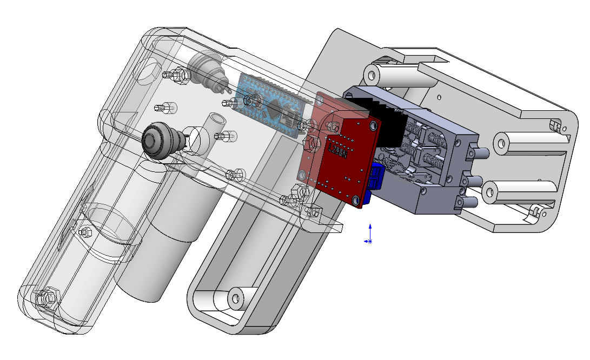

# System Overview

This document provides a **system-level technical overview** of the tendon-driven soft endoscopic robot,
focusing on subsystem decomposition, signal flow, and control integration.
For a general project introduction and motivation, please refer to the main `README.md`.
## Overall Mechanical and Control Layout

The figure above shows the integrated CAD assembly of the tendon-driven soft endoscopic robot.
The embedded control board, motor-driven actuation unit, and mechanical transmission are
co-located within a compact housing to enable handheld operation.

The design ensures that all electronic components (microcontroller, motor drivers, and wiring)
can be enclosed without interfering with tendon routing or bending motion.

---

## 1. System Decomposition

The system is organized into four interacting subsystems:

1. Human Interface Subsystem  
2. Embedded Control Subsystem  
3. Actuation and Sensing Subsystem  
4. Soft Robotic End-Effector  

This modular decomposition enables independent development and validation of each subsystem,
which is particularly important for early-stage medical and soft robotic prototypes.

---

## 2. Subsystem Responsibilities

### 2.1 Human Interface Subsystem

The human interface subsystem enables intuitive human-in-the-loop control and includes:

- A joystick for continuous velocity-based bending commands
- A reset button for returning the system to a neutral (home) configuration
- An auxiliary button reserved for CMOS lens cleaning actuation

Velocity-based input was selected to provide smooth and safe manipulation,
avoiding abrupt motion commands that may be unsuitable for soft robotic systems.

---

### 2.2 Embedded Control Subsystem

The embedded control subsystem is implemented on an **Arduino Nano** and is responsible for:

- Processing joystick and button inputs in real time
- Generating PWM signals for motor actuation
- Monitoring quadrature encoder feedback
- Enforcing software-defined safety constraints
- Managing reset and homing behavior

All control logic is executed locally on the embedded platform,
ensuring low latency and system portability without reliance on external computation.

---

### 2.3 Actuation and Sensing Subsystem

The actuation and sensing subsystem consists of:

- DC geared motors driven by an L298N dual H-bridge motor driver
- Quadrature encoders for rotational feedback
- Lead screw transmission converting motor rotation into linear tendon displacement

Encoder feedback provides an estimate of tendon displacement,
which is used to infer bending angle and enforce motion constraints.

---

### 2.4 Soft Robotic End-Effector

The soft robotic end-effector is a tendon-driven continuum structure capable of bending in two orthogonal planes:

- Vertical bending (up / down)
- Horizontal bending (left / right)

Differential tendon actuation produces smooth and continuous bending motion.
The mechanical design limits the maximum bending angle to ±90° per axis,
which is enforced through software-level constraints.

---

## 3. Control and Safety Integration

Safety is a primary design consideration due to the medical and soft robotic context.
Encoder feedback is continuously monitored to enforce software-defined end stops,
preventing excessive tendon pulling and potential mechanical failure.

A manual homing mechanism allows the system to return to a neutral configuration at any time,
providing an additional layer of operational safety.

---

## 4. Validation Scope

This system overview corresponds to the **experimentally validated control and actuation subsystems**.
The following aspects were validated on a physical prototype:

- Embedded motor control and signal flow
- Encoder-based displacement monitoring
- Software-enforced safety limits
- Human-in-the-loop operation and reset behavior

Full integration with the complete soft robotic body and CMOS vision system
was intentionally excluded at this stage and is considered future work.

---

---

# 系统总体概述（System Overview）

本文档从系统层面对**基于腱索驱动的软体内窥镜机器人**进行技术性概述，
重点介绍系统模块划分、信号流向以及控制集成方式。
项目的整体背景与动机请参见主 `README.md`。

---

## 1. 系统模块划分

系统整体由以下四个子系统构成：

1. 人机交互子系统  
2. 嵌入式控制子系统  
3. 执行与感知子系统  
4. 软体机器人末端执行器  

该模块化架构有助于各子系统的独立开发与验证，
尤其适用于早期医疗与软体机器人原型系统。

---

## 2. 各子系统功能说明

### 2.1 人机交互子系统

人机交互子系统支持人在回路的直观控制方式，主要包括：

- 摇杆：用于连续的速度型弯曲控制
- 回位按键：将系统恢复至中立初始位置
- 辅助按键：预留用于 CMOS 镜头清洁等功能

采用基于速度的控制方式，
有助于实现平滑且安全的软体机器人操控，避免突变指令。

---

### 2.2 嵌入式控制子系统

嵌入式控制子系统以 **Arduino Nano** 为核心，主要负责：

- 实时处理摇杆与按键输入
- 生成电机 PWM 控制信号
- 采集与解析编码器反馈
- 实现软件层安全约束
- 管理回位与复位逻辑

所有控制逻辑均在嵌入式平台本地运行，
无需依赖外部计算资源，从而保证系统实时性与可移植性。

---

### 2.3 执行与感知子系统

执行与感知子系统包括：

- 由 L298N 驱动的直流减速电机
- 正交编码器用于角度反馈
- 丝杠传动机构，将电机旋转转换为腱索线性位移

编码器反馈用于估算腱索位移，
并进一步用于弯曲角度推断与安全限制。

---

### 2.4 软体机器人末端执行器

软体末端执行器采用腱索驱动的连续体结构，
可在两个正交平面内实现弯曲：

- 上 / 下方向
- 左 / 右方向

通过对腱索张力的差动控制，
实现连续、平滑的弯曲运动。
机械结构限制单轴最大弯曲角度为 ±90°，
该限制通过软件方式进行约束。

---

## 3. 控制与安全集成

鉴于医疗与软体机器人应用的安全需求，
系统持续监测编码器反馈以实现软件端止挡，
防止腱索过度牵拉导致结构损坏。

同时设置手动回位机制，
允许操作者在任意时刻将系统恢复至安全中立状态。

---

## 4. 验证范围说明

本系统概述对应于**已完成实体验证的控制与执行子系统**。
已验证内容包括：

- 嵌入式电机控制与信号流
- 基于编码器的位移监测
- 软件安全限位机制
- 人机交互与回位控制逻辑

完整软体机器人本体与 CMOS 视觉系统尚未集成，
相关内容作为后续研究与系统扩展方向。
